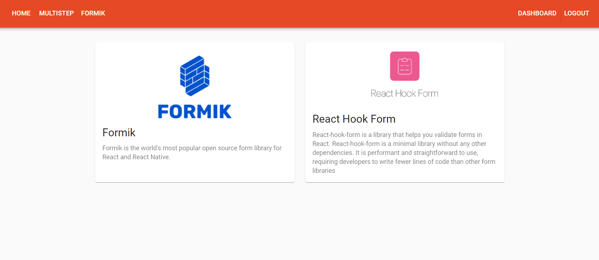

# About app
This is a fairly simple application that I decided to write to brush up on my knowledge of form validation and typescript

## List of technologies used
* React
* Redux Toolkit
* Context API
* React Router DOM
* Typescript
* Material UI
* Formik
* React Hook Form
* React Drop Zone

## Link of workin app
https://sob-alex.github.io/react-forms-multistep-typescript/#/
## Screenshots

